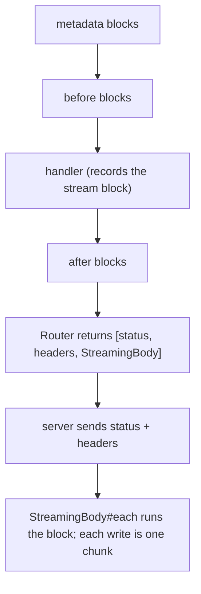

# Streaming Responses

A normal Raxon response is buffered: the handler sets a body, the Router
serializes it, and the server sends it with a Content-Length. A streaming
response sends the status and headers first and then produces the body chunk
by chunk while the handler's block runs. Use it for Server-Sent Events (SSE),
LLM token streams, large exports, and anything else where the client must
see the first bytes before the last are known.

## Basic use

```ruby
# routes/api/v1/export/get.rb
Raxon.route do
  response 200, content_type: "text/plain"

  handler do |request, response, metadata|
    response.stream(content_type: "text/plain") do |out|
      Report.each_line { |line| out.write(line) }
    end
  end
end
```

`response.stream` records the block and sets the content type. The block does
not run inside the handler. It runs later, when the server iterates the Rack
body, and each `out.write` reaches the client at once.

`out` responds to `write` and `<<`. Both accept anything with `to_s`.

## Server-Sent Events

`response.sse` sets `content-type: text/event-stream` and
`cache-control: no-cache`, then yields a `Raxon::SSE` writer that formats
the protocol:

```ruby
# routes/api/v1/chat/post.rb
Raxon.route do
  body type: :object do
    property :prompt, type: :string
  end
  response 200, content_type: "text/event-stream"

  handler do |request, response, metadata|
    prompt = request.params[:prompt]

    response.sse do |events|
      completion(prompt).each_token do |token|
        events.event("token", {text: token})
      end
      events.event("done", {})
    end
  end
end
```

On the wire:

```
event: token
data: {"text":"Hel"}

event: token
data: {"text":"lo"}

event: done
data: {}

```

The writer has these methods:

| Method | Writes |
| --- | --- |
| `event(type, data, id: nil, retry_ms: nil)` | A named event. `data` is JSON-encoded unless it is a String. |
| `data(data, id: nil)` | An unnamed event, delivered to `EventSource`'s `message` listener. |
| `comment(text = "")` | A comment line. Clients ignore it. Send one periodically as a keepalive. |

A multi-line String payload is split into one `data:` line per line, as the
protocol requires.

## Lifecycle

Streaming changes when the body is produced, not the order of the pipeline:



Consequences:

- After blocks run before any byte is streamed. They can set headers. They
  cannot read or rewrite the streamed body.
- Response validation is skipped for a streaming response. There is no body
  to check when the pipeline returns.
- A `handle` block that streams can return anything. The return value is
  ignored, so it does not become a body.
- `response.stream` raises `Raxon::Error` when a body is already set. A
  response is streamed or buffered, not both.
- A HEAD request served by a GET route gets the stream's headers and no body.
  The block never runs.
- The Router never emits a Content-Length for a stream. The server uses
  chunked transfer encoding (HTTP/1.1) or its own framing (HTTP/2).

## Errors inside the stream

When the client disconnects mid-stream, the server raises from the write
(`IOError`, `Errno::EPIPE`, or `Errno::ECONNRESET`). `Raxon::StreamingBody`
rescues these. A closed tab is not an application error.

Any other exception raised in the block propagates to the server, which logs
it and closes the connection. The status was already sent, so
`config.rescue_from` and `Raxon::ErrorHandler` cannot turn it into a 500.
Rescue inside the block if the client needs an error event:

```ruby
response.sse do |events|
  events.event("token", {text: generate})
rescue Upstream::Timeout => e
  events.event("error", {message: e.message})
end
```

The body is always closed after the block, whether it finished, raised, or
the client left.

## Deployment notes

- Puma streams a Rack body as it is iterated. Do not wrap a Raxon server
  that streams in `Rack::ContentLength`; it buffers the body to count it.
- A reverse proxy may buffer responses. For nginx, send
  `response.header "x-accel-buffering", "no"` before streaming, or disable
  `proxy_buffering` for the location.
- SSE clients reconnect automatically. Use the `id:` option and read
  `request.headers["Last-Event-ID"]` to resume.

## OpenAPI

Declare the response with the streamed media type and no body type:

```ruby
response 200, content_type: "text/event-stream"
```

The generated document lists the media type under `content` with no schema.
A response with a type keeps its schema under the given media type, so
`response 200, type: :string, content_type: "text/csv"` documents a string
body served as CSV.

## Testing

`Raxon::Test` reads a streamed body to completion, so a test sees the full
output:

```ruby
require "raxon/test/rspec"

RSpec.describe "GET /api/v1/chat" do
  include Raxon::Test::Methods

  it "streams tokens" do
    response = post("/api/v1/chat", json: {prompt: "hi"})

    expect(response.headers["content-type"]).to eq("text/event-stream")
    expect(response.body).to include("event: token")
  end
end
```

Outside the test helper, iterate the body yourself:

```ruby
status, headers, body = Raxon::Router.new.call(env)
chunks = []
body.each { |chunk| chunks << chunk }
body.close
```
